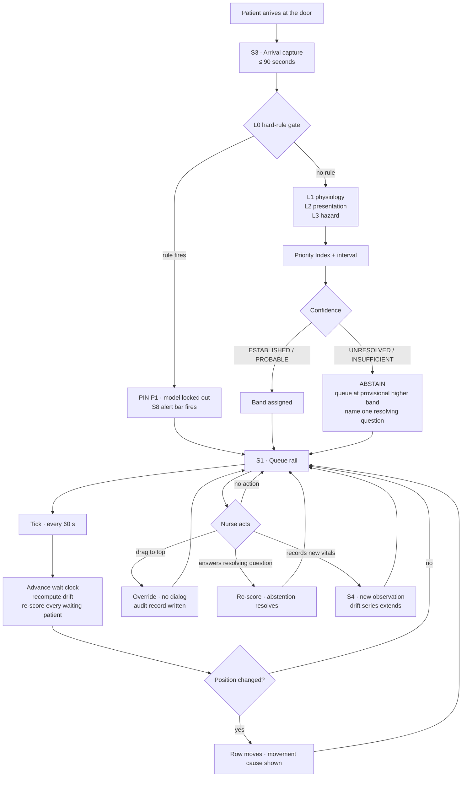
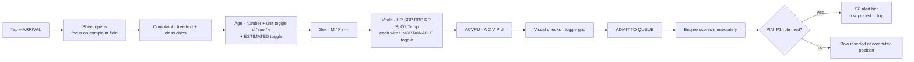
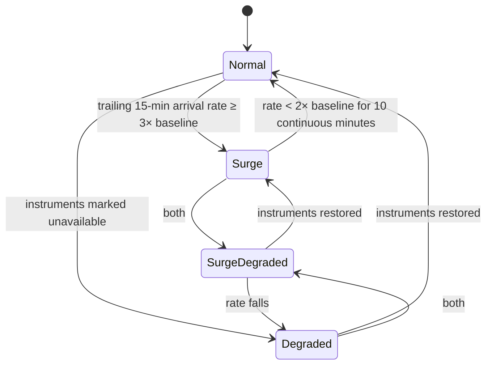

# 03 · App Flow
### Every screen, every navigation path, every interaction trigger

| | |
|---|---|
| **Purpose** | Removes all guesswork about what exists on screen and what happens when it is touched. If a behaviour is not in this document, it does not exist. |
| **Depends on** | `01-PRD.md`, `02-TRD.md` |
| **Revision** | 1.0 |

---

## 1. Screen inventory

The application is **one page**. There is no router and no navigation. Everything is a region of the board or an overlay on top of it. This is deliberate: a nurse who has to navigate has already lost the two minutes they had.

| # | Region | Type | Always visible? |
|---|---|---|---|
| S0 | **Board header** | Persistent strip | Yes |
| S1 | **Queue rail** | Primary region (left, ~62%) | Yes |
| S2 | **Inspector** | Secondary region (right, ~38%) | Yes — shows the selected row, or the board summary when nothing is selected |
| S3 | **Arrival capture** | Overlay sheet | On demand |
| S4 | **Re-assessment sheet** | Overlay sheet | On demand / on prompt |
| S5 | **Audit drawer** | Bottom drawer | On demand |
| S6 | **Fairness monitor** | Full-region takeover of S1+S2 | On demand |
| S7 | **Surge banner** | Header-attached strip | Automatic |
| S8 | **Absolute-emergency alert** | Interruptive bar, top | Automatic, rare |
| S9 | **Simulation console** | Footer strip | Prototype only |

**S9 is prototype scaffolding and is visually marked as such.** It exists so a judge can drive the demo. It carries a `PROTOTYPE CONTROLS — NOT PART OF THE CLINICAL PRODUCT` label and is the only element in the interface that is allowed to look like a control panel.

---

## 2. Top-level flow



---

## 3. S0 · Board header

A single 44 px strip. It is a running header of a clinical document, not a navigation bar.

```
┌──────────────────────────────────────────────────────────────────────────────┐
│ EMERGENCY DEPARTMENT · TRIAGE BOARD        14:32:07   WAITING 18   P1 1  P2 4 │
│ Protocol v1 · Engine 1.0.0 · Last recompute 00:12 ago     [FAIRNESS] [AUDIT]  │
└──────────────────────────────────────────────────────────────────────────────┘
```

| Element | Behaviour |
|---|---|
| Department + board name | Static |
| Clock | Simulation clock, updates each second, tabular figures so digits do not shift |
| Census counts | Waiting total, then counts per band, updated on each tick |
| Protocol / engine version | Always visible. A nurse must be able to say which rule set produced a decision. Tapping opens the protocol file in read-only view. |
| Last recompute age | Turns to an alarm state if it exceeds 90 s — the interface must never silently stop being live |
| `[FAIRNESS]` | Opens S6 |
| `[AUDIT]` | Opens S5 |

**Trigger:** the recompute-age counter is driven by the tick, not by a separate timer. If the tick loop dies, the counter freezes and then alarms. This is intentional — a frozen clock is a visible failure rather than an invisible one.

---

## 4. S1 · Queue rail (the primary surface)

One row per waiting patient, ordered by Priority Index descending. This list *is* the product.

### 4.1 Row anatomy

```
 ┌── band ── id ────── age/sex ── complaint ───────── vitals ─────────── wait ── conf ──┐
 │  P2   PT-0007   61 M   Stomach ache, radiating   132 98/62 24 94% 37.1   38m   ◐ UNRES │
 │       ▲ moved up 3 · HR ↑12 over 30 min                      resolve: pain radiating? │
 └──────────────────────────────────────────────────────────────────────────────────────┘
```

| Zone | Content | Notes |
|---|---|---|
| Band chip | `P1`–`P5`, or `⊘` when abstaining | Never colour alone — the letter+number is the primary carrier |
| Encounter ID | `PT-0007` | Monospace, tabular |
| Age / sex | `61 M`, `3 y F`, `6 mo M`, `~40 ?` for estimated | Estimated ages carry `~` |
| Complaint | Truncated to one line at the row width | Full text in inspector |
| Vitals strip | HR · SBP/DBP · RR · SpO₂ · Temp, monospace, fixed columns | `——` for unobtainable; each value carries an arrow when it has drifted |
| Wait | Minutes since arrival | Turns to escalation state when the reassessment interval has elapsed |
| Confidence | `●` established · `◑` probable · `◐` unresolved · `○` insufficient — always with a text token | Two carriers, per NFR-6 |
| Movement line | Appears **only** when the row moved on the last tick, with the cause | Disappears after 3 ticks |
| Resolve line | Appears only when abstaining | The single question, verbatim |

### 4.2 Row states

| State | Trigger | Visual treatment |
|---|---|---|
| Normal | default | Hairline rule below, no fill |
| Selected | tap / arrow keys | 2 px left marker, inspector loads |
| Moved up | position improved on last tick | Movement line with cause, ▲ marker |
| Overdue reassessment | wait > interval for band | Wait cell inverts, `REASSESS` token appears |
| Abstaining | confidence UNRESOLVED / INSUFFICIENT | Band chip becomes `⊘` over the provisional band, resolve line shown |
| Unresolvable | confidence UNRESOLVABLE | Band chip `⊘` over the provisional band; in place of the resolve line, `ESCALATE — questioning cannot separate P2 from P3` with the recorded reason. Queued at the provisional band like any abstention; it is never a reason to defer care. |
| Rule-pinned | any `PIN_P1` rule fired | Alarm rule above and below the row, `LOCKED` token, cannot be sorted below any other row |
| Overridden | nurse moved it | `NURSE` token with the nurse's band; engine band shown struck through in the inspector, never hidden |
| Collapsed | surge mode, rank > 5 | Single 20 px line: band, ID, complaint, wait only |

### 4.3 Interaction triggers

| Gesture / key | Effect |
|---|---|
| Tap row | Select; inspector loads that encounter |
| `↑` / `↓` | Move selection |
| Long-press + drag, or `Shift+↑` | Begin override reposition |
| Drop, or `Enter` | Commit override. **No dialog. No justification field.** Audit record written immediately. |
| Tap `[+ ARRIVAL]` | Open S3 |
| Tap the vitals strip | Open S4 for that patient |
| Tap the resolve line | Open a three-button answer for the resolving question (`Yes` / `No` / `Cannot assess`) |
| `Esc` | Deselect |
| `A` | Open audit drawer |
| `F` | Open fairness monitor |

**Override has no confirmation step by design (PRD FR-4.1).** A confirmation dialog is a two-second tax levied on the person the system exists to serve, at exactly the moment they have decided the machine is wrong. The audit log, not the dialog, is what makes the override safe.

---

## 5. S2 · Inspector — the derivation panel

This panel is the FDA "independently review the basis" requirement made visible. It reads top to bottom as an argument, not as a dashboard.

```
PT-0007 · 61 M                                          PRIORITY INDEX  63.4
Stomach ache, radiating to left arm                     ├────────■───────┤
Walk-in · arrived 13:54 · waited 38 min                  55.1          71.7

CONFIDENCE  ◐ UNRESOLVED — cannot separate P2 from P3
            Tie broken upward. Undertriage cost 8:1.
            Queued at P2 while unresolved.

ONE QUESTION WOULD RESOLVE THIS
   "Does the pain radiate to the jaw, shoulder or arm?"
   [ YES ]   [ NO ]   [ CANNOT ASSESS ]

DERIVATION
   L0  Hard rules              none fired                            —
   L1  Physiology              NEWS2 aggregate 4                 +4
       HR 132                  score 3                           
       SpO2 94%                score 1
       Temp                    NOT OBTAINED — interval widened
   L2  Presentation            abdominal_pain                    +6
       Age ≥55 with diaphoresis                                  +7
       Atypical ACS pattern flagged
   L3  Hazard                  38 min at P3 rate 0.10            +3.8
       Drift  HR ↑12 over 30 min                                 +2.1

VITAL TREND (45 min)
   HR    120 → 132   ↑ rising, 4 of 4 readings
   SpO2   96 →  94   ↓ falling
   RR     20 →  24   ↑ rising

REASSESS DUE  14:47  (in 15 min)
ENGINE 1.0.0 · PROTOCOL v1 · COMPUTED 14:32:07
```

| Behaviour | Rule |
|---|---|
| Empty state | When no row is selected, the inspector shows board-level summary: census by band, oldest un-reassessed patient, current mode, override count this shift |
| Every number is traceable | Each derivation line names its source layer and its point contribution. Nothing appears without a reason. |
| Missing data is stated, not omitted | `NOT OBTAINED — interval widened` is a line item, not an absence |
| Overridden patients | Show both: `ENGINE RECOMMENDED P3` (struck) and `NURSE ASSIGNED P2`, plus the timestamp. The engine's view is never erased. |
| Answering the resolving question | Immediately re-scores, the abstention resolves or narrows, and the resolution is written to the audit log as an information event |

---

## 6. S3 · Arrival capture

A single overlay sheet, no steps, no wizard, no pagination. Everything visible at once because a nurse cannot hold a form's state in their head across screens.



**Field rules**

| Field | Required | Behaviour when absent |
|---|---|---|
| Chief complaint | No | Class defaults to `unknown`, base risk 8. **Absence of a complaint is not absence of risk.** |
| Age | No | Falls to `~adult` with a widened interval and a visible `AGE ESTIMATED` token |
| Sex | No | `—`; sex modifiers do not apply and the interval widens |
| Each vital | No | Individually markable `UNOBTAINABLE`; each one reduces evidence completeness by its weight |
| ACVPU | Yes | The only mandatory field. It is a look, not a measurement, and it drives two hard rules. |
| Visual checks | No | Toggles: pale · diaphoretic · drowsy · distressed · cyanosed · active bleeding · cannot speak in full sentences · airway compromise · seizure now · heavy vaginal bleeding *(shown only when pregnancy status is pregnant or postpartum)* |
| Complaint qualifiers | No | One-tap chips shown for the selected complaint class: thunderclap · neck stiffness · neurovascular compromise · radiating · exertional · sudden onset · carer reports a change from baseline. These drive presentation modifiers; the engine never parses the free-text complaint. |

**The zero-history path is the default path.** A patient with no name, no age, no history and no ability to speak produces a complete, scoreable record. There is no "unknown patient" special mode because unknown is the normal case.

**Capture budget: 90 seconds.** Numeric fields use a large keypad, not the OS keyboard. Class chips are one tap. The whole sheet is reachable without scrolling at 1280×800.

---

## 7. S4 · Re-assessment

Opens from the vitals strip of a row, or from a reassessment prompt.

Contains only what changes: the five vitals, ACVPU, and the visual grid — pre-filled with the previous values so the nurse edits deltas rather than retyping. Committing appends a new observation to the series, which immediately feeds L3 drift.

**Trigger for the prompt:** `wait > reassessInterval[band]`. The row enters the *overdue reassessment* state. It does not disappear, and it does not silently lapse — PRD FR-3.6. An un-reassessed patient becomes *more* visible over time, never less.

---

## 8. S5 · Audit drawer

Slides up over the lower half. Append-only, newest first, exportable.

| Column | Content |
|---|---|
| Time | Simulation timestamp |
| Encounter | ID |
| Event | `ARRIVAL` · `SCORE` · `RULE_FIRED` · `OVERRIDE` · `REASSESS` · `QUESTION_ANSWERED` · `MODE_CHANGE` · `PROTOCOL_CHANGE` |
| Engine said | Band + confidence at that instant |
| Nurse did | Band assigned, where applicable |
| Basis | The full derivation snapshot, expandable |
| Chain | Truncated SHA-256, and the verification state of the chain |

Two actions: `EXPORT JSON` and `EXPORT CSV`. Both produce a file a clinician can read without this application (PRD FR-4.4).

**Override record shape** — the complete system state at the moment of the override, so that a reviewer six months later can reconstruct exactly what the nurse was looking at:

```jsonc
{
  "eventId": "EV-000148",
  "type": "OVERRIDE",
  "at": "2026-08-23T14:41:02+05:30",
  "encounterId": "PT-0007",
  "engineBand": "P3",
  "engineConfidence": "UNRESOLVED",
  "engineIndex": 63.4,
  "engineInterval": [55.1, 71.7],
  "rulesFired": [],
  "inputsSnapshot": { "hr": 132, "sbp": 98, "rr": 24, "spo2": 94, "temp": null, "acvpu": "A" },
  "derivationSnapshot": { … },
  "nurseBand": "P2",
  "nurseId": "STAFF-04",
  "reasonChip": null,
  "prevHash": "9f2c…", "hash": "41ab…"
}
```

`reasonChip` is nullable and is filled after the fact if at all. The override took effect before this record was complete.

---

## 9. S6 · Fairness monitor

Takes over the board region. Three panels, no decorative chrome.

| Panel | Content |
|---|---|
| **Assigned priority by subgroup** | Horizontal bars: sex (M/F/—), age band (0–1, 1–5, 5–16, 16–65, 65–80, 80+), language. Distribution of bands per subgroup. |
| **Undertriage proxy** | Rate of *acuity upgrade after triage* per subgroup — the observable stand-in for undertriage. The **worst-served subgroup is named in words at the top**, not left for the reader to find in a chart. |
| **Drift** | Each subgroup's proxy over the shift against its tolerance band. Crossing the tolerance raises a flag with the subgroup named and the encounters reachable. |

Wording rule: this panel never reports an average. The headline sentence is always of the form *"Women aged 45–65 presenting with chest pain are upgraded after triage at 2.3× the board rate."* An aggregate fairness number is how bias hides.

---

## 10. S7 · Surge mode



**On entering Surge:**
1. A header-attached strip states the mode, the trigger and the numbers: `SURGE MODE · 19 arrivals/hour · 3.2× baseline · entered 14:38`.
2. Ranks 1–5 stay in full row form. Everything from rank 6 down collapses to a 20 px line.
3. The inspector switches to a five-patient stack rather than a single-patient detail.
4. Reassessment intervals shorten by 33% for P2 and P3 — crowding is exactly when reassessment lapses, so the system compensates in the opposite direction to the department.
5. A `MODE_CHANGE` audit record is written with the trigger values.

**On entering Degraded (instruments unavailable):**
1. All instrument-derived vitals render as `——` and score as unobtainable.
2. Evidence completeness falls; intervals widen; more patients enter abstention.
3. The banner names what has been lost: `DEGRADED — no monitors. Scoring from visual assessment and complaint only. Cannot discriminate P2 from P3 for 6 patients.`
4. The queue keeps moving. Degraded is not a stop condition.

---

## 11. S8 · Absolute-emergency alert

Fires the instant a `PIN_P1` rule evaluates true, independently of queue position or which screen is open.

- A full-width interruptive bar at the very top, above the header.
- Text: the encounter ID, the rule label, and the measured value that fired it — `PT-0013 · RULE-CONSC-01 · ACVPU = U · unresponsive`.
- One action: `ACKNOWLEDGE`. Acknowledgement is logged; it does not clear the pin.
- The row is locked to the top of the queue and **cannot be sorted below any other row**, including by override. A nurse may override a band upward; the interface does not offer a path to move a rule-pinned patient down. (Recorded as an open question in the PRD only insofar as who may edit the rules — not whether the lock holds.)

These alerts are rare by construction. The rules are absolute physiological criteria, not probabilistic thresholds, which is what keeps this the only interruptive element in the interface and keeps alert fatigue out of the design.

---

## 12. S9 · Simulation console *(prototype only)*

A footer strip, visually marked as scaffolding.

| Control | Effect |
|---|---|
| `▶ / ❚❚` | Run / pause the simulation clock |
| `1× 10× 60×` | Clock speed. 60× advances an hour of waiting-room time in a minute — this is how the live re-triage becomes visible in a five-minute pitch. |
| `SURGE ×3` | Inject arrivals at 18/hour |
| `LOSE MONITORS` | Enter degraded mode |
| `RESET` | Reload the cohort at t=0 |
| `t + 15 min` | Jump the clock forward |

---

## 13. The demo path (five minutes, in order)

This is the sequence the prototype is built to support, and the order the pitch should follow.

| # | Action | What it proves |
|---|---|---|
| 1 | Board loads at t=0 with 20 patients | Scoring on a realistic cohort |
| 2 | Select **PT-0004** (82 F, "just not right") | Geriatric atypical presentation — normal-looking vitals, P2 from presentation risk. Read the derivation aloud. |
| 3 | Select **PT-0011** (3 y, T 38.5, HR 168) | Age-banded scoring. Show that the same numbers in an adult would score differently. |
| 4 | Select **PT-0007** (61 M, "stomach ache") | **Abstention.** The system refuses to guess and names one question. Answer it; watch the band resolve. |
| 5 | Run the clock at 60× for ~45 simulated minutes | **The queue is alive.** PT-0002 rises on RR/SpO₂ drift with the cause stated on the row. |
| 6 | Drag **PT-0020** (52 F, chest pain, normal vitals) to the top | **The nurse decides.** No dialog. Open the audit drawer — the complete captured state is there. |
| 7 | Press `SURGE ×3` | Disaster mode. Top five stay, the rest collapse, the trigger is stated. |
| 8 | Press `LOSE MONITORS` | Degraded mode. Intervals widen, the banner names which bands can no longer be separated, the queue keeps moving. |
| 9 | Open the fairness monitor | The worst-served subgroup named in a sentence. |
| 10 | Turn off the network and reload | **Stage 1 is real.** It still works. |

Step 10 is the one that ends the argument. Everything before it is a claim about software; step 10 is a claim about a district hospital at 2 a.m., and it is the one that decides whether this deploys.
