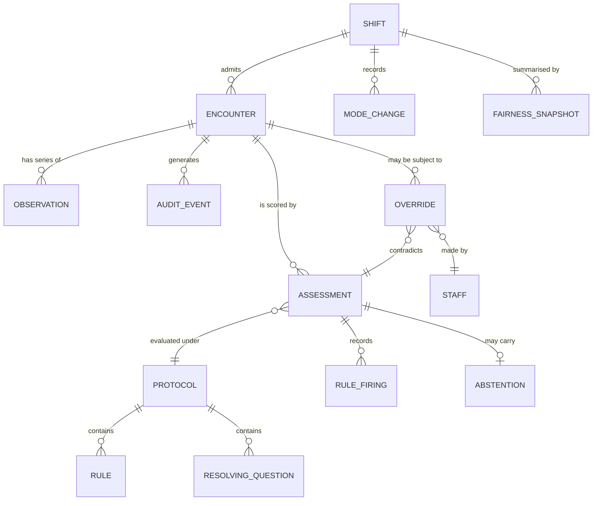

# 05 · Backend Schema
### Data models, storage, relations, authorisation and retention

| | |
|---|---|
| **Purpose** | The complete data contract. Stage 1 is device-local and has no server; Stage 2 introduces one. Both are specified here so that Stage 1 is not built into a corner. |
| **Depends on** | `01-PRD.md`, `02-TRD.md` |
| **Revision** | 1.0 |

---

## 1. Stage-1 principle: the schema is local, and it is minimal

Stage 1 has **no backend**. Everything lives on the tablet. This is not a limitation to be apologised for — it is the deployment story (PRD §10, "one tablet, offline") and it is also the strongest privacy posture available: data that never leaves the device cannot be breached in transit or at rest on someone else's infrastructure.

| Store | Mechanism | Contents | Lifetime |
|---|---|---|---|
| `session` | `localStorage` | Current shift, board mode, UI preferences | Until shift close |
| `encounters` | `localStorage` (JSON) | Live waiting-room encounters | 24 h, then purged |
| `observations` | `localStorage` (JSON) | Vital-sign series per encounter | 24 h |
| `audit` | IndexedDB, object store `audit` | Append-only, hash-chained event log | 7 years, de-identified at shift close |
| `protocol` | Static JSON, fetched | Hospital-owned rules and thresholds | Versioned artefact |
| `cohort` | Static JSON, fetched | Prototype only — synthetic encounters | Prototype only |

Everything in this document is written so that the same entities move to PostgreSQL at Stage 2 without a field changing name or meaning.

---

## 2. Entity relationship model



**The relation that carries the product:** one encounter has *many* assessments. A triage category in a conventional system is a single value on a patient row. Here it is a time series, because the central claim is that a frozen category is the hazard. `ENCOUNTER` has no `band` column — the current band is always `latest(ASSESSMENT).band`. Making that structurally impossible to shortcut is a design decision, not an accident.

---

## 3. Core entities

### 3.1 `ENCOUNTER`

One person, one visit. **No identity is required.**

| Field | Type | Null | Notes |
|---|---|---|---|
| `encounter_id` | `TEXT` PK | no | `PT-0007`. Locally generated, sequential per shift, meaningless off-device. |
| `shift_id` | `TEXT` FK | no | |
| `arrived_at` | `TIMESTAMPTZ` | no | |
| `arrival_mode` | `ENUM` | yes | `walk_in` `ambulance` `referred` `police` `unknown` |
| `age_value` | `INTEGER` | yes | Null permitted — unidentified patients are the normal case |
| `age_unit` | `ENUM` | yes | `days` `months` `years` |
| `age_estimated` | `BOOLEAN` | no | Default `false`. Drives the `~` prefix and a widened interval. |
| `age_band` | `ENUM` | no | Derived, never entered: `neonate` `infant` `toddler` `preschool` `school` `adolescent` `adult` `older_adult` `elderly`. **Computed before any scoring table is selected.** |
| `sex` | `ENUM` | yes | `M` `F` `X` `unknown` |
| `pregnancy_status` | `ENUM` | yes | `not_pregnant` `pregnant` `postpartum` `unknown` |
| `gestation_weeks` | `INTEGER` | yes | |
| `complaint_text` | `TEXT` | yes | Free text as spoken. Retained verbatim — the phrasing is clinically informative. |
| `complaint_class` | `ENUM` | no | Default `unknown`, base risk 8. Absence of a complaint is not absence of risk. |
| `language` | `TEXT` | yes | BCP-47. Collected **solely** to power the fairness monitor. |
| `preexisting_flags` | `TEXT[]` | yes | `diabetic` `anticoagulated` `immunosuppressed` `cardiac_history`. Only when volunteered — never required. |
| `complaint_qualifiers` | `TEXT[]` | yes | One-tap chips from arrival capture: `thunderclap` `neck_stiffness` `neurovascular_compromise` `radiating` `exertional` `sudden_onset` `reported_change_from_baseline`. Presentation modifiers read this; the engine never parses `complaint_text`. |
| `disposition` | `ENUM` | yes | `waiting` `in_treatment` `discharged` `left_without_being_seen` `transferred` |
| `disposition_at` | `TIMESTAMPTZ` | yes | |
| `created_at` | `TIMESTAMPTZ` | no | |

**Deliberately absent:** name, MRN, national ID, address, phone, next of kin, insurance, photograph. None is needed to triage, so none is collected. This is data minimisation as architecture rather than as policy.

`age_band` being a stored derived column matters: a fever of 38.5 °C carries different urgency in a 3-year-old than in a 75-year-old, and every scoring path must branch on the band *before* it reaches a threshold table. Storing it makes the branch auditable after the fact.

### 3.2 `OBSERVATION`

One set of vitals at one moment. An encounter accumulates a series; the series is what produces drift.

| Field | Type | Null | Notes |
|---|---|---|---|
| `observation_id` | `TEXT` PK | no | |
| `encounter_id` | `TEXT` FK | no | |
| `observed_at` | `TIMESTAMPTZ` | no | |
| `sequence` | `INTEGER` | no | 0 = arrival set |
| `hr` | `INTEGER` | yes | bpm |
| `sbp` | `INTEGER` | yes | mmHg |
| `dbp` | `INTEGER` | yes | mmHg |
| `rr` | `INTEGER` | yes | /min |
| `spo2` | `INTEGER` | yes | % |
| `spo2_on_oxygen` | `BOOLEAN` | yes | NEWS2 scores supplemental oxygen separately |
| `temp_c` | `NUMERIC(3,1)` | yes | °C |
| `acvpu` | `ENUM` | **no** | `A` `C` `V` `P` `U`. The only mandatory clinical field — it is a look, not a measurement, and it drives two hard rules. |
| `pain_score` | `INTEGER` | yes | 0–10 |
| `cap_refill_s` | `NUMERIC(2,1)` | yes | Paediatric perfusion |
| `unobtainable` | `TEXT[]` | no | Which fields were attempted and could not be obtained |
| `visual` | `JSONB` | no | Toggle set, below |
| `source` | `ENUM` | no | `nurse_manual` `monitor_feed` `simulated` |
| `recorded_by` | `TEXT` FK | yes | `STAFF-04` |

`unobtainable` is a distinct concept from `NULL`. `NULL` means not recorded; `unobtainable` means attempted and failed — no working monitor, patient combative, cuff size unavailable. Only `unobtainable` triggers degraded-mode handling and the widened interval. Conflating the two would let a skipped field silently masquerade as a device failure.

`visual` shape:

```jsonc
{
  "pale": false, "diaphoretic": true, "drowsy": false, "distressed": true,
  "cyanosed": false, "active_major_bleeding": false,
  "cannot_speak_full_sentences": false, "airway_compromise": false,
  "seizure_active": false, "heavy_vaginal_bleeding": false
}
```

### 3.3 `ASSESSMENT`

One engine run. **Immutable.** Never updated — a new run creates a new row. This is what makes the priority history reconstructible.

| Field | Type | Null | Notes |
|---|---|---|---|
| `assessment_id` | `TEXT` PK | no | |
| `encounter_id` | `TEXT` FK | no | |
| `observation_id` | `TEXT` FK | no | Latest observation used |
| `computed_at` | `TIMESTAMPTZ` | no | |
| `engine_version` | `TEXT` | no | Semver. Recorded on every score (PRD NFR-8). |
| `protocol_version` | `TEXT` FK | no | |
| `priority_index` | `NUMERIC(5,2)` | no | 0–100 |
| `interval_low` | `NUMERIC(5,2)` | no | |
| `interval_high` | `NUMERIC(5,2)` | no | |
| `band` | `ENUM` | **yes** | `P1`–`P5`. **Null when abstaining** — and that is the point. |
| `provisional_band` | `ENUM` | no | Always populated. Drives queue position even under abstention. |
| `band_set_by` | `ENUM` | no | `model` · `hard_rule` · `presentation_floor` · `nurse_override`. Which mechanism decided the band. "P2 because a rule fired" and "P2 because the index landed there" are different claims, and a reviewer needs to know which one they are reading. |
| `candidate_bands` | `TEXT[]` | yes | Populated when abstaining |
| `confidence` | `ENUM` | **no** | `ESTABLISHED` `PROBABLE` `UNRESOLVED` `UNRESOLVABLE` `INSUFFICIENT` |
| `no_question_reason` | `ENUM` | yes | `all_questions_already_answered` · `no_question_above_information_threshold` · `no_questions_defined_for_class`. Required when and only when `confidence = 'UNRESOLVABLE'`. |
| `expected_information_gain` | `NUMERIC(3,2)` | yes | 0–1, for the question that was offered |
| `evidence_completeness` | `NUMERIC(3,2)` | no | 0–1 |
| `model_locked_out` | `BOOLEAN` | no | True when a `PIN_P1` rule fired |
| `tie_broken_upward` | `BOOLEAN` | no | |
| `layer1_physiology` | `NUMERIC(4,2)` | no | |
| `layer2_presentation` | `NUMERIC(4,2)` | no | |
| `layer3_hazard` | `NUMERIC(4,2)` | no | |
| `derivation` | `JSONB` | no | Full human-readable derivation |
| `resolving_question_id` | `TEXT` FK | yes | |
| `reassess_due_at` | `TIMESTAMPTZ` | no | |

**Database-level invariants** — these enforce PRD principles P1, P3 and P5 in the schema itself, so that no application bug can produce a record that violates them:

```sql
CONSTRAINT chk_confidence_present
  CHECK (confidence IS NOT NULL),

CONSTRAINT chk_band_or_provisional
  CHECK (band IS NOT NULL OR provisional_band IS NOT NULL),

CONSTRAINT chk_abstention_names_candidates
  CHECK (confidence NOT IN ('UNRESOLVED','UNRESOLVABLE','INSUFFICIENT')
         OR (band IS NULL AND array_length(candidate_bands,1) >= 2)),

-- UNRESOLVED always names a question. This constraint is not weakened;
-- the case with no question is a different state, below.
CONSTRAINT chk_unresolved_names_question
  CHECK (confidence <> 'UNRESOLVED' OR resolving_question_id IS NOT NULL),

CONSTRAINT chk_unresolvable_names_reason
  CHECK (confidence <> 'UNRESOLVABLE'
         OR (resolving_question_id IS NULL AND no_question_reason IS NOT NULL)),

CONSTRAINT chk_reason_only_when_unresolvable
  CHECK (no_question_reason IS NULL OR confidence = 'UNRESOLVABLE'),

CONSTRAINT chk_locked_out_is_p1
  CHECK (NOT model_locked_out OR provisional_band = 'P1'),

CONSTRAINT chk_interval_contains_point
  CHECK (priority_index BETWEEN interval_low AND interval_high)
```

The last one has caught more engine bugs in development than any test.

### 3.4 `RULE_FIRING`

Which hard rules fired, on which assessment, on what measured value.

| Field | Type | Notes |
|---|---|---|
| `firing_id` | `TEXT` PK | |
| `assessment_id` | `TEXT` FK | |
| `rule_id` | `TEXT` FK | `RULE-CONSC-01` |
| `protocol_version` | `TEXT` FK | |
| `matched_field` | `TEXT` | `acvpu` |
| `matched_value` | `TEXT` | `U` |
| `action` | `ENUM` | `PIN_P1` `FLOOR_P2` `FLAG` |
| `alerted_at` | `TIMESTAMPTZ` | |
| `acknowledged_by` | `TEXT` FK, null | Acknowledgement is logged; it does not clear the pin |
| `acknowledged_at` | `TIMESTAMPTZ`, null | |

### 3.5 `OVERRIDE`

The nurse's decision. The most important table in the system — it is the evidence that the human, not the machine, holds authority.

| Field | Type | Null | Notes |
|---|---|---|---|
| `override_id` | `TEXT` PK | no | |
| `encounter_id` | `TEXT` FK | no | |
| `assessment_id` | `TEXT` FK | no | The exact assessment being contradicted |
| `staff_id` | `TEXT` FK | no | |
| `at` | `TIMESTAMPTZ` | no | |
| `engine_band` | `ENUM` | yes | Copied, not joined — the record must be readable standalone |
| `engine_confidence` | `ENUM` | no | Copied |
| `engine_index` | `NUMERIC(5,2)` | no | Copied |
| `nurse_band` | `ENUM` | no | |
| `direction` | `ENUM` | no | Derived: `upgrade` `downgrade` `lateral` |
| `reason_chip` | `TEXT` | **yes** | **Nullable by design.** Attached afterwards if at all. The move took effect before this field existed. |
| `inputs_snapshot` | `JSONB` | no | Full state the nurse was looking at |
| `derivation_snapshot` | `JSONB` | no | |

`reason_chip` being nullable is a product decision expressed as a schema decision. A `NOT NULL` here would make a justification field mandatory, which would put a dialog in front of the override, which would break PRD FR-4.1. The schema is where that promise is kept or broken.

`direction` is what makes the calibration loop work: a systematic upgrade pattern for a given complaint class and subgroup is the signal that the model is undertriaging that group, and it is fed back into threshold review — the model learns from the nurse, never the reverse.

### 3.6 `PROTOCOL`, `RULE`, `RESOLVING_QUESTION`

The hospital-owned artefact. **Not code.** A deploying hospital changes its red-flag thresholds by editing a versioned JSON file that goes through its own clinical governance, without a software release.

```jsonc
{
  "protocolVersion": "v1",
  "hospital": "REFERENCE-ED",
  "effectiveFrom": "2026-08-01",
  "approvedBy": "ED Clinical Governance Committee",
  "supersedes": null,
  "populations": ["adult", "paediatric", "obstetric"],
  "rules": [
    {
      "id": "RULE-CONSC-01",
      "label": "Unresponsive or pain-responsive",
      "population": "all",
      "condition": { "field": "acvpu", "op": "in", "value": ["P", "U"] },
      "action": "PIN_P1",
      "alert": "immediate",
      "rationale": "ESI v5 decision point A — requires immediate lifesaving intervention.",
      "source": "ESI Handbook v5 2023; local protocol v1"
    }
  ],
  "bandThresholds": { "P1": 82, "P2": 62, "P3": 38, "P4": 18 },
  "hazardRates":   { "P2": 0.22, "P3": 0.10, "P4": 0.035, "P5": 0.012 },
  "reassessMinutes": { "P2": 15, "P3": 30, "P4": 60, "P5": 120 },
  "costMatrix": { "undertriage": 8, "overtriage": 1 },
  "surge": { "baselineArrivalsPerHour": 6, "multiplier": 3,
             "reassessCompressionPct": 33 },
  "resolvingQuestions": [
    {
      "id": "RQ-ABDO-01",
      "complaintClass": "abdominal_pain",
      "question": "Does the pain radiate to the jaw, shoulder or arm?",
      "discriminatesBetween": ["P2", "P3"],
      "expectedShiftIfYes": 14,
      "expectedShiftIfNo": -6
    }
  ]
}
```

Every threshold that a clinician might reasonably disagree with lives in this file. Nothing clinically contestable is hard-coded. `protocolVersion` appears in the board header at all times and on every assessment, so a reviewer can always answer "which rule set produced this decision".

### 3.7 `AUDIT_EVENT`

Append-only, hash-chained, tamper-evident.

| Field | Type | Notes |
|---|---|---|
| `event_id` | `TEXT` PK | `EV-000148`, monotonic |
| `sequence` | `INTEGER` | Gapless, per shift |
| `shift_id` | `TEXT` FK | |
| `at` | `TIMESTAMPTZ` | |
| `type` | `ENUM` | `ARRIVAL` `SCORE` `RULE_FIRED` `ALERT_ACK` `OVERRIDE` `REASSESS` `QUESTION_ANSWERED` `MODE_CHANGE` `PROTOCOL_CHANGE` `DISPOSITION` `EXPORT` |
| `encounter_id` | `TEXT` FK, null | Null for shift-level events |
| `actor` | `TEXT` | `STAFF-04` or `SYSTEM` |
| `payload` | `JSONB` | Complete event body |
| `prev_hash` | `TEXT` | SHA-256 of the previous record |
| `hash` | `TEXT` | `SHA-256(sequence ‖ at ‖ type ‖ canonical_json(payload) ‖ prev_hash)` |

**Chaining.** Each record's hash covers its predecessor's. Altering or removing any record breaks every subsequent hash, and the chain is verifiable offline with a fifteen-line script. Computed with `crypto.subtle.digest` on-device; no server is involved and no key management is required, because the property we need is *detection*, not prevention.

`UPDATE` and `DELETE` are not permitted on this table under any role. At Stage 2 this is enforced by grant, not by convention (§5).

### 3.8 `SHIFT`, `STAFF`, `MODE_CHANGE`, `FAIRNESS_SNAPSHOT`

| Entity | Key fields |
|---|---|
| `SHIFT` | `shift_id`, `department_id`, `started_at`, `ended_at`, `protocol_version`, `baseline_arrivals_per_hour` |
| `STAFF` | `staff_id` (pseudonymous), `role` (`triage_nurse` `charge_nurse` `physician` `administrator` `auditor`), `department_id`. **No names.** A pseudonymous ID is sufficient for accountability and avoids building a staff-surveillance dataset. |
| `MODE_CHANGE` | `shift_id`, `at`, `from_mode`, `to_mode`, `trigger` (JSONB: the actual measured values), `auto` |
| `FAIRNESS_SNAPSHOT` | `shift_id`, `at`, `dimension` (`sex` `age_band` `language`), `subgroup`, `n`, `mean_assigned_band`, `upgrade_after_triage_rate`, `tolerance`, `flagged`, `is_worst_served` |

`FAIRNESS_SNAPSHOT` stores per-subgroup rows and never a board aggregate, because the reporting rule is *worst-served, not average* (PRD FR-6.2). Making the aggregate unavailable in the schema means it cannot be reported by accident.

---

## 4. Stage-2 storage

| | |
|---|---|
| Database | PostgreSQL 15+ |
| Extensions | `pgcrypto` (hashing), `btree_gist` (temporal exclusion) |
| Partitioning | `ASSESSMENT` and `AUDIT_EVENT` by month — one assessment per patient per minute is roughly 500k rows/month at 200 visits/day |
| Time series | Native timestamptz; TimescaleDB optional and not required |
| Integration | Read-only HL7v2 ADT and FHIR R4 `Observation` ingest into `OBSERVATION` with `source = monitor_feed`. **Read-only. The system never writes to the hospital record.** |
| Sync | Device is the source of truth during a shift; assessments and audit records push on reconnect. Conflict policy: append-only, so there are no conflicts — the device's chain is grafted with its own segment identifier. |

Required indexes:

```sql
CREATE INDEX ix_assessment_latest
  ON assessment (encounter_id, computed_at DESC);
CREATE INDEX ix_observation_series
  ON observation (encounter_id, observed_at DESC);
CREATE INDEX ix_audit_chain
  ON audit_event (shift_id, sequence);
CREATE INDEX ix_encounter_waiting
  ON encounter (shift_id) WHERE disposition = 'waiting';
CREATE INDEX ix_override_calibration
  ON override (direction, at DESC);
```

---

## 5. Authorisation

Enforced at Stage 2 with PostgreSQL row-level security. Stage 1 has a single device role and physical custody of the tablet is the access control — stated honestly rather than dressed up as a security model.

| Role | ENCOUNTER | OBSERVATION | ASSESSMENT | OVERRIDE | AUDIT_EVENT | PROTOCOL | FAIRNESS |
|---|---|---|---|---|---|---|---|
| `triage_nurse` | C R U¹ | C R | R | **C** R | append only | R | — |
| `charge_nurse` | R U¹ | C R | R | C R | append only | R | R |
| `physician` | R U² | C R | R | C R | append only | R | R |
| `administrator` | — | — | R³ | R³ | R | **C R U** | R |
| `auditor` | R³ | R³ | R³ | R³ | R | R | R |
| `system` | C R U | C R | C | — | append only | R | C |

¹ own department, current shift only  ² including disposition  ³ de-identified projection only

Non-negotiable grants:

```sql
REVOKE UPDATE, DELETE ON audit_event  FROM PUBLIC;
REVOKE UPDATE, DELETE ON assessment   FROM PUBLIC;
GRANT  INSERT, SELECT  ON audit_event  TO app_all_roles;
```

`ASSESSMENT` is insert-only for the same reason `AUDIT_EVENT` is: a mutable score history would make the central claim of the product — that priority is a trajectory, not a verdict — unverifiable.

**Administrators cannot read identified encounter rows.** Fairness oversight requires subgroup statistics, not individual patients, and the schema gives administrators exactly what oversight needs and nothing more.

Row-level policy for the nurse role:

```sql
CREATE POLICY nurse_current_shift ON encounter
  FOR ALL TO triage_nurse
  USING (shift_id = current_setting('app.shift_id')
         AND department_id = current_setting('app.department_id'));
```

---

## 6. Retention and de-identification

| Data | Retention | At expiry |
|---|---|---|
| `ENCOUNTER` (live) | 24 h on device | Purged |
| `OBSERVATION` | 24 h on device | Purged |
| `ASSESSMENT` | 90 days identified, then de-identified | Exact age → age band; complaint text → class only; timestamps → 15-min buckets |
| `AUDIT_EVENT` | 7 years | De-identified at shift close; the hash chain is recomputed over the de-identified payloads and **both chain roots are retained** so the transformation is itself auditable |
| `OVERRIDE` | 7 years, de-identified | Retained for calibration |
| `FAIRNESS_SNAPSHOT` | Indefinite | Already aggregate, never identified |
| `PROTOCOL` | Indefinite | Superseded versions retained — an assessment must always be interpretable under the rules in force at the time |

**Regulatory frame.** Primary: **India's DPDP Act 2023** — purpose limitation, data minimisation, storage limitation, and the fiduciary duties that follow from processing health data. The same design satisfies **HIPAA** §164.312(b) audit controls and §164.514 de-identification, and **GDPR** Art. 9(2)(h) processing for health care with Art. 5(1)(c) minimisation, without modification.

The reason one design satisfies three regimes is that Stage 1 collects no direct identifier at all. Compliance is cheap when there is nothing to protect, and that is an architectural choice made at the first schema decision rather than a legal exercise performed afterwards.

**What a clinician override must legally record**, and does: who (pseudonymous staff ID), when (timestamp), what the system recommended (band, confidence, index, interval), what the clinician decided (band), what the clinician was looking at (full inputs and derivation snapshot), and under which rule set (protocol version). This is the complete set required for an independent reviewer to reconstruct the decision, and it is exactly what §3.5 stores.

---

## 7. Stage-1 JSON shapes

The literal contents of `localStorage`, so an agent implementing `storage.js` has no ambiguity.

```jsonc
// key: "ptai.session.v1"
{
  "shiftId": "SH-20260823-A",
  "departmentId": "ED-REF-01",
  "startedAt": "2026-08-23T08:00:00+05:30",
  "protocolVersion": "v1",
  "engineVersion": "1.0.0",
  "mode": "NORMAL",              // NORMAL | SURGE | DEGRADED | SURGE_DEGRADED
  "nextEncounterSeq": 21,
  "nextEventSeq": 149,
  "staffId": "STAFF-04"
}

// key: "ptai.encounters.v1"
{ "PT-0007": { /* ENCOUNTER, §3.1 */ } }

// key: "ptai.observations.v1"
{ "PT-0007": [ /* OBSERVATION[], ascending by sequence, §3.2 */ ] }

// key: "ptai.assessments.v1"     — ring buffer, last 20 per encounter
{ "PT-0007": [ /* ASSESSMENT[], ascending by computed_at, §3.3 */ ] }

// IndexedDB: db "ptai", store "audit", keyPath "sequence", index "byEncounter"
{ /* AUDIT_EVENT, §3.7 */ }
```

**Storage failure is not a failure state.** If `localStorage` is unavailable — private browsing, full quota, a locked-down tablet — the application runs entirely in memory and displays a `NOT PERSISTING` token in the header. Every read and write is wrapped in `try/catch` and the board renders correctly with no stored value. A triage board that refuses to start because it cannot write to disk is a triage board that is not there when the department needs it.

---

## 8. Engine ↔ storage contract

| Rule | Rationale |
|---|---|
| `engine/` never touches storage, the DOM, or `Date.now()` | Determinism (PRD NFR-8) and testability. `now` is always an argument. |
| An `ASSESSMENT` is written on every tick for every waiting encounter | The trajectory is the product |
| Assessments are capped at the last 20 per encounter on device; older ones survive in the audit log | Bounded memory without losing the record |
| An `AUDIT_EVENT` of type `SCORE` is written only on **band or confidence change**, not on every tick | 20 patients × 60 ticks/hour × 8 hours = 9,600 events/shift if unfiltered; change-only reduces this by roughly 95% while losing nothing a reviewer needs |
| Every write to `AUDIT_EVENT` recomputes and verifies the chain head first | A broken chain surfaces immediately, not at export |
| Export produces JSON and CSV, both readable without the application | PRD FR-4.4 |

---

*Standards referenced: [ESI Handbook v5, 2023](https://californiaena.org/wp-content/uploads/2023/05/ESI-Handbook-5th-Edition-3-2023.pdf) · [RCP NEWS2](https://professionals.wrha.mb.ca/files/covid-19-ltc-news2-vital-signs-record.pdf) · [FDA CDS Software guidance, revised Jan 2026](https://www.cov.com/news-and-insights/insights/2026/01/5-key-takeaways-from-fdas-revised-clinical-decision-support-cds-software-guidance)*
