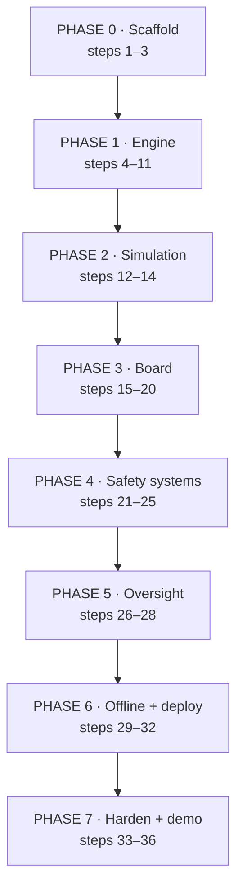

# 06 · Implementation Plan
### The build sequence — exactly what to build first, second and next

| | |
|---|---|
| **Purpose** | A chained, ordered development sequence for an AI coding agent or a human. Each step names its inputs, its deliverable, and the test that says it is finished. **Do not start a step until the previous step's exit test passes.** |
| **Depends on** | All of `01`–`05` |
| **Revision** | 1.0 |

---

## 0. How to use this document

**If you are an AI coding agent:** read `01-PRD.md`, `02-TRD.md`, `04-UIUX-BRIEF.md` in full before writing a line. Then work one step at a time, in order. At the end of each step, run the exit test and stop. Do not batch steps. Do not skip to the interesting part.

**The three rules that override everything else:**

1. **No build step, no framework, no runtime dependency.** (TRD §1–2)
2. **The prohibited-design list in `04-UIUX-BRIEF.md` §2.1 is binding.** No purple, no gradient, no shadow, no Inter, no icon library, no cards.
3. **`engine/` is pure.** No DOM, no storage, no `Date.now()`. `now` is always a parameter.

**Ordering principle:** the engine is built and tested before anything is rendered. This is the opposite of the usual instinct, and it is deliberate. The engine is the product; the board is a view of it. Building the UI first produces an interface that shapes the clinical logic to fit it, which is how safety-critical software goes wrong.

---

## 1. Sequence overview



| Phase | Steps | Deliverable at the end |
|---|---|---|
| 0 · Scaffold | 1–3 | Repo, tokens, a page that renders nothing but is correctly styled |
| 1 · Engine | 4–11 | A tested, pure scoring engine with abstention. **No UI at all.** |
| 2 · Simulation | 12–14 | 20 encounters advancing on a clock, logged to console |
| 3 · Board | 15–20 | The queue and inspector rendering live |
| 4 · Safety | 21–25 | Override, audit chain, surge, degraded, alerts |
| 5 · Oversight | 26–28 | Fairness monitor, export, reassessment prompts |
| 6 · Offline | 29–32 | Service worker, manifest, Vercel, GitHub |
| 7 · Harden | 33–36 | Accessibility, performance, design audit, demo rehearsal |

---

## PHASE 0 · Scaffold

### Step 1 — Repository skeleton
**Build:** the directory tree in TRD §3, including `tests/` and `docs/`. Application files are created empty; `.gitignore` takes its contents verbatim from TRD §3.1 and `vercel.json` from TRD §10. `docs/07-DECISION-LOG.md` is created here with its index table and any decisions already taken.
**Preserve:** every file already in the repository. TRD §3 is the required tree, not an exclusion list.
**Do not:** run `npm init` at the repository root. The only package manifest is `tests/package.json`, and it is created in Step 11 when the first test needs Playwright — `node:test` needs no manifest at all.
**Exit test:** every path in TRD §3 exists; no pre-existing file was deleted or moved; `.gitignore` matches §3.1 verbatim.

### Step 2 — Design tokens
**Build:** `assets/css/board.css` containing **only** the token block — every custom property from UIUX §3.1, §3.2, §3.3, §4.1, §4.2, §5.1, §5.2, plus the `@media (prefers-color-scheme: dark)` override block and the Google Fonts `@import` for IBM Plex Sans, Sans Condensed, Mono and Serif.
**Exit test:** open a scratch page that prints one swatch per token. Every token resolves. No literal hex appears below the token block. Compute every pair in the UIUX §3.4 table and confirm the measured ratio matches the value printed there — the table states measurements, so a mismatch means either the token or the table is wrong, and both must be reconciled before Step 3.

### Step 3 — Page shell
**Build:** `index.html` with the semantic region skeleton from UIUX §5.3 (`<header>`, the grid, `<table>` with `<caption>` and `<thead>`, inspector `<aside>`, `<footer>` colophon). `assets/js/util/dom.js` (`el`, `on`, `text` — thirty lines, no library). `main.js` importing nothing yet.
**Exit test:** the page loads with the correct grid proportions at 1280×800 and 1024×768, the colophon renders, and the diff contains zero `box-shadow`, zero `border-radius` above 2 px, and zero gradients.

---

## PHASE 1 · The engine (no UI)

> Everything in this phase is pure functions. Nothing renders. Resist the urge to look at it.

### Step 4 — Protocol file
**`assets/data/protocol.v1.json` ships complete in this repository.** Do not author it, do not regenerate it, and do not "improve" its structure — it is clinical content under hospital governance, and its shape is documented in TRD §12.

**Build:** nothing. Read TRD §12 in full and verify the shipped file against it.
**Exit test:** the file parses; all 14 rules carry `id`, `label`, `population`, `condition`, `action`, `alert`, `rationale`, `source`; every complaint class in `presentation.classes` has at least one entry in `resolvingQuestions`; every band array in `physiology` is contiguous with no gaps and no overlaps; every `table` path referenced by an `aboveAgeBandCeiling` operator resolves.

If verification fails, **stop and report** — a defect here is a clinical-content defect, not a coding task.

### Step 5 — Age banding
**Build:** `engine/physiology.js` — `ageBand(ageValue, ageUnit)` returning the enum from Backend Schema §3.1.
**Why first:** every scoring path branches on the band *before* reaching any threshold table. Getting this wrong is the single highest-consequence bug available in this codebase.
**Exit test:** unit tests at every boundary — 27 d / 28 d, 11 mo / 12 mo, 2 y / 3 y, 15 y / 16 y, 64 y / 65 y, 79 y / 80 y. Null age returns `adult` with the estimated flag.

### Step 6 — Layer 0, hard-rule gate
**Build:** `engine/rules.js` — `evaluateRules(encounter, observation, protocol)` returning `RULE_FIRING[]`. A generic condition evaluator over `{ field, op, value }` supporting `<`, `>`, `<=`, `>=`, `in`, `=`, and the paediatric formula operator `lt_pediatric_hypotension`.
**Exit test:** every rule in TRD §4.1 fires on a crafted positive case and stays silent on a crafted negative. `PIN_P1` always sets `modelLockedOut = true`. **Additionally assert that no `population: adult` rule ever fires for a paediatric encounter** — construct a 3-year-old at SpO₂ 87 and RR 7 and confirm RULE-RESP-01 and RULE-RESP-02 stay silent while RULE-PAED-04 and RULE-PAED-05 both fire.

### Step 7 — Layer 1, physiology
**Build:** the adult NEWS2 table (TRD §4.2.1) **exactly as published**, the paediatric age-band tables (§4.2.2), and the obstetric shift (§4.2.3). Return `{ score, perParameter[], missing[], singleParameterThree }`.
**Exit test:** transcribe the published NEWS2 chart into a fixture and assert every cell. Assert the single-parameter-3 flag independently of the aggregate. Assert paediatric hypotension at ages 1, 5 and 10 against `70 + 2 × age`. **Assert that each of the three population paths scores all seven parameters and can reach exactly 20**, against `physiology.parameterMaxima.populationPaths` — a path that cannot reach 20 is missing a parameter. Assert paediatric SpO₂ boundaries at 91/92, 94/95 and 96/97, and the bradypnoea floor for every age band.
**Watch for:** the boundary values. NEWS2 scores RR 20 as 0 and RR 21 as 1. Off-by-one here is a clinical error, not a cosmetic one.

### Step 8 — Layer 2, presentation
**Build:** `engine/presentation.js` — the complaint-class table and modifier set from TRD §4.3. Every modifier that fires returns its label and points.
**Exit test:** PT-0007's profile (61 M, `abdominal_pain`, `radiating` qualifier, **not** diaphoretic) returns base 6 + 7 with PM-AB-01 labelled — the modifier fires on either limb, not both. `unknown` class returns base 8. `chest_pain` with every modifier firing returns 20, **and the derivation still lists all four modifiers with a clamped flag.** Every qualifier chip in Backend Schema §3.1 is referenced by at least one modifier — an unused chip is a capture field that cannot affect a score.

### Step 9 — Layer 3, hazard and drift
**Build:** `engine/hazard.js` — time hazard by band and drift from the observation series (TRD §4.4). A single observation returns drift 0 **and** sets `singleReading = true`.
**Exit test:** reproduce the worked example in TRD §4.4 to the stated value. A single-observation encounter never produces non-zero drift.

### Step 10 — Uncertainty and abstention
**Build:** `engine/uncertainty.js` — evidence completeness, interval half-width including `driftUncertainty`, the **five** confidence levels, `expectedInformationGain`, and deterministic question ranking (TRD §4.6).
**Exit test:** removing each input in turn reduces completeness by its documented weight. An interval straddling a boundary at a 60:40 split yields `UNRESOLVED` with two candidate bands and exactly one question. `E < 0.45` yields `INSUFFICIENT`. **A question whose `alreadyAnsweredWhen` holds is never offered** — assert with PT-0007 that RQ-ABDO-01 is suppressed and RQ-ABDO-02 is returned instead. When every question for the class is suppressed, the state is `UNRESOLVABLE` with reason `all_questions_already_answered` — **never `UNRESOLVED` with a null question**; assert that combination throws. Assert the same for a question scoring below `minimumInformationGain`, with reason `no_question_above_information_threshold`. Assert question ranking is stable across 100 runs with shuffled input key order.

**Assert every fixture in `protocol.v1.json → workedExamples`** — `PT-0007-abstention` (suppression, chosen question, EIG 0.7747), `RQ-ABDO-01-if-not-suppressed` (0.8663), all five `driftUncertainty` cases including the zero at one observation and the cap at two, and both `consistencyCases` — **identical drift magnitude, four readings, differing only in agreement, must produce 1.63 against 4.67.** `monotonicFraction` is 0 below three observations. These fixtures exist so that a numeric value drifting out of step with a formula fails a test rather than blocking a later step; treat a failure here as a defect in whichever of the two is wrong, and report rather than adjusting the fixture to match the code.

### Step 11 — Banding, tie-break, and the contract assertion
**Build:** `engine/bands.js` and `engine/index.js` — combine the layers (TRD §4.5), apply the asymmetric tie-break, apply hard-rule and **presentation floors** in the order at §12.4 steps 4–7, set `bandSetBy`, assemble the `Assessment` object (TRD §4.7), and **throw** on any of the seven contract violations listed there.
**Note on ordering.** This step's golden snapshots need the cohort, and the cohort ships complete in the repository (Step 12 builds only its loader). Read `assets/data/cohort.json` directly here; a minimal inline reader is acceptable, and Step 12 replaces it with the real interpolating loader.

**Exit test — this is the gate for the whole phase:**
- **Every `expect` block in `cohort.json` passes** — band, `bandSetBy`, confidence, and rules fired, at each stated minute. These are clinical intent and are authoritative. If one fails, report it; do not edit the cohort to match the engine. Note that `bandIn` / `confidenceIn` accept any member of the listed set: they are used where the exact value is not the clinical point, and asserting a single value there would make the fixture brittle rather than informative.
- **Abstention fires only at P1/P2 and P2/P3.** Assert that an interval straddling P3/P4 or P4/P5 tie-breaks upward and reports `PROBABLE` with no resolving question. PT-0012 and PT-0018 are the fixtures.
- Golden-file snapshot of all 20 cohort encounters at t=0, t=30 and t=60. Golden files are **generated** from the engine and then reviewed once against the `expect` blocks — they capture detail the expectations do not, and they exist to detect future drift, not to define correctness.
- **Property test, 10,000 random encounters:** every output has a `confidence`; every `PIN_P1` yields `P1`; `interval_low ≤ priorityIndex ≤ interval_high`; identical inputs produce byte-identical output.
- **Assert the floor arithmetic directly:** an encounter with `L1 = 1` and `L2 = 20` and `L3 = 20` reaches only PI 56.5 by the continuous score, and lands at P2 *only* via the presentation floor with `bandSetBy = "presentation_floor"`. This is the property that makes atypical presentations catchable at all.
- Manually verify the named cases against clinical intuition: PT-0004 and PT-0020 reach P2 on presentation with unremarkable vitals, PT-0007 abstains at P2/P3, PT-0011 fires RULE-PAED-03 on the preschool ceiling, PT-0013 pins to P1 with no identity, PT-0019 returns INSUFFICIENT and still queues at P2.

> **Do not proceed to Phase 2 until every test in Step 11 is green.** Every downstream phase assumes the engine is correct, and an engine bug found in Phase 5 costs ten times what it costs here.

---

## PHASE 2 · Simulation

### Step 12 — Cohort loader
**`assets/data/cohort.json` ships complete in this repository**, alongside `protocol.v1.json`. It is clinical content: 20 synthetic encounters, each with keyframed trajectories and an `expect` block stating the band, mechanism and confidence it must produce. Do not author it and do not adjust its values to make a test pass.

**Build:** `sim/cohort.js` only — load the file, linearly interpolate between keyframes, hold the last keyframe thereafter, and project each encounter into the flat field view the engine reads.
**Exit test:** interpolation at a keyframe returns the keyframe exactly; between keyframes returns the linear value at field precision; after the last returns the last. `unobtainable` survives projection as `unobtainable`, distinct from null. PT-0002 at t=45 reproduces its final keyframe.

### Step 13 — Clock
**Build:** `clock.js` — a simulation clock with run/pause and 1× / 10× / 60× speeds, emitting a tick. **`Date.now()` appears nowhere else in the codebase.**
**Exit test:** at 60×, one wall-clock minute advances one simulated hour. Pause freezes every derived value.

### Step 14 — Tick loop, headless
**Build:** wire clock → advance trajectories → score every encounter → sort by index. Log the ordered board to the console each tick.
**Exit test:** run 90 simulated minutes headless. PT-0002 rises past PT-0010. No encounter's `lastRecomputeAge` exceeds 60 s. Recompute of 20 encounters completes in under 100 ms.

---

## PHASE 3 · The board

### Step 15 — Queue table
**Build:** `render/board.js` — the fixed-column table from UIUX §5.4, one row per encounter, band chip, vitals with units, wait, confidence indicator. Keyed by encounter ID, rows reused across renders.
**Exit test:** 20 rows render; vitals align vertically down the whole list; `——` shows for unobtainable; no zebra striping; every numeric cell uses `tabular-nums`.

### Step 16 — Row states
**Build:** the eight states in App Flow §4.2 — normal, selected, moved, overdue, abstaining, rule-pinned, overridden, collapsed.
**Exit test:** each state is reachable and each carries hue **and** text token **and** glyph. Screenshot every state.

### Step 17 — Movement and the two animations
**Build:** rank-change detection, the movement line with its cause string, and the two animations from UIUX §7 — value flash and row translate. Nothing else animates.
**Exit test:** at 60× the movement is followable by eye. `prefers-reduced-motion: reduce` substitutes the persistent marker. `grep -c "animation\|transition"` in the CSS returns only the two.

### Step 18 — Inspector
**Build:** `render/inspector.js` — the full layout in App Flow §5: index with confidence band, confidence statement, resolving question, the complete layered derivation, vital trends, reassessment time, engine and protocol footer.
**Exit test:** every number on the panel is traceable to a derivation line. Missing inputs appear as stated line items, never as absences. The empty state shows the board summary.

### Step 19 — Charts
**Build:** `render/charts.js` — the confidence band, the sparkline, and the fairness bars as hand-authored inline SVG (UIUX §6.3, §6.5, §6.6). **No charting library.**
**Exit test:** the confidence band's marker sits at the point estimate and the span matches the interval. Sparklines render with six to eight points, 1 px stroke, no axes.

### Step 20 — Arrival and reassessment sheets
**Build:** `S3` and `S4` per App Flow §6 and §7. Numeric keypad, not the OS keyboard. Per-field `UNOBTAINABLE` toggles. ACVPU the only required field.
**Exit test:** **time a full capture — it must complete in under 90 seconds on a touch device.** A patient with no age, no sex, no complaint and no obtainable vitals still produces a scoreable record. No scrolling required at 1280×800.

---

## PHASE 4 · Safety systems

### Step 21 — Override
**Build:** drag-to-reposition and `Shift+↑`/`↓` + `Enter`. **No dialog. No justification field.** The override commits before anything else happens.
**Exit test:** override completes in one interaction. The inspector shows the engine band struck through beside the nurse band — never hidden.

### Step 22 — Audit log and hash chain
**Build:** `audit.js` — IndexedDB append-only store, the record shape in Backend Schema §3.7, SHA-256 chaining via `crypto.subtle`, chain verification on every write. `SCORE` events written on band-or-confidence change only, not every tick.
**Exit test:** an override writes a record containing the complete state from App Flow §8. Verification passes on a clean chain and fails on a hand-tampered record. An 8-hour simulated shift produces under 500 events, not 9,600.

### Step 23 — Audit drawer and export
**Build:** `S5` per App Flow §8, with JSON and CSV export.
**Exit test:** the exported file is readable and reconstructible without the application. Chain verification passes on the export.

### Step 24 — Surge mode
**Build:** `sim/surge.js` — 3× arrival injection, automatic mode entry and exit, top-five retention, row collapse, the 33% reassessment compression, the stated trigger banner, and a `MODE_CHANGE` audit record carrying the measured values.
**Exit test:** injecting 18 arrivals/hour enters surge within 15 simulated minutes. Ranks 6+ collapse. The banner states the actual rate and multiplier, not a generic message. Exit requires 10 continuous minutes below 2×.

### Step 25 — Degraded mode and the emergency alert
**Build:** the instrument-unavailable path — all instrument vitals to unobtainable, widened intervals, and a banner that **names which bands can no longer be discriminated and for how many patients**. Then `S8`, the absolute-emergency alert bar, firing on any `PIN_P1`, with logged acknowledgement that does not clear the pin.
**Exit test:** in degraded mode more patients enter abstention, the queue keeps ordering, and the banner counts them correctly. PT-0013 fires the alert on load; acknowledging logs the event and leaves the pin. No path exists to sort a pinned row below another row.

---

## PHASE 5 · Oversight

### Step 26 — Fairness monitor
**Build:** `fairness.js` and `S6` per App Flow §9 — subgroup distributions by sex, age band and language; upgrade-after-triage as the undertriage proxy; the worst-served subgroup named **in a sentence** at the top; drift against tolerance.
**Exit test:** the headline is a specific sentence naming a subgroup and a multiple. **No aggregate fairness number appears anywhere on the panel.** Flagged subgroups are reachable to their encounters.

### Step 27 — Reassessment prompts
**Build:** the overdue state driven by `reassessMinutes` per band, escalating visibility over time.
**Exit test:** a P3 waiting 31 minutes enters overdue. An un-reassessed patient becomes more visible, never less, and is never dropped from the board.

### Step 28 — Simulation console
**Build:** `S9` per App Flow §12, visibly marked `PROTOTYPE CONTROLS — NOT PART OF THE CLINICAL PRODUCT`.
**Exit test:** every control in the App Flow §12 table works. The console is unmistakably scaffolding and could be deleted in one commit.

---

## PHASE 6 · Offline and deployment

### Step 29 — Service worker
**Build:** `sw.js` — precache manifest covering HTML, CSS, all JS modules, both JSON files, and the four Plex font files; cache-first; versioned cache name with cleanup on activate.
**Exit test:** **serve the app over HTTP, load it once, disable the network, hard-reload. It works completely.** This is the Stage-1 product claim (TRD §1); it is not optional and it is not a nice-to-have. Note that `file://` is not the test — service workers do not register on that scheme.

### Step 30 — Manifest and tablet install
**Build:** `manifest.webmanifest` — landscape orientation, standalone display, the ground colour as theme colour, maskable icon.
**Exit test:** installs to an Android tablet home screen and opens without browser chrome in landscape.

### Step 31 — GitHub
**Build:** `README.md` — what it is, what it is not, the 10-step demo path from App Flow §13, how to run locally, links to all six docs, and an explicit "synthetic data only, not for clinical use" notice. Then initialise and push.
```bash
git init && git add -A
git commit -m "PatientTriage.ai: engine, board, safety systems, offline shell"
git branch -M main
git remote add origin git@github.com:<org>/patienttriage-ai.git
git push -u origin main
```
**Exit test:** a clean clone plus `python3 -m http.server 8000` runs the application with no install step.

### Step 32 — Vercel
**Build:** import the repo. Framework preset `Other`, build command empty, output directory `.`. Confirm the `vercel.json` headers from TRD §10 apply.
**Exit test:** the production URL loads in under 2 s, the service worker registers over HTTPS, security headers are present, and a pull request produces a working preview URL.

---

## PHASE 7 · Hardening and the demo

### Step 33 — Accessibility pass
**Build:** to UIUX §9 — keyboard path, focus rings, ARIA live regions, table semantics, 200% zoom.
**Exit test:** complete the full demo path with the mouse unplugged. axe reports zero violations. Simulate deuteranopia and confirm every state is still separable.

### Step 34 — Performance pass
**Exit test:** every budget in TRD §7 met, measured — not estimated. Total transfer ≤ 120 kB gzipped. Board recompute ≤ 100 ms at 60 encounters. Zero long tasks over 50 ms during a tick.

### Step 35 — Design audit
**Exit test:** work the UIUX §11 checklist line by line against the full diff. Then the harder test: **show the deployed URL to three people and ask whether it looks AI-generated.** If any of them hesitates, the answer is in §2.1 — find which line was crossed.

### Step 36 — Demo rehearsal
**Exit test:** run the 10-step path in App Flow §13 end to end, timed, three times. It must fit five minutes with room to be interrupted. Step 10 — network off, reload, still working — is the closing move and must be rehearsed until it is boring.

---

## 2. Definition of done

The prototype is finished when all of the following are simultaneously true:

- [ ] 20 synthetic encounters score correctly against the golden file
- [ ] An ambiguous case (PT-0007) abstains and names exactly one resolving question
- [ ] A paediatric case (PT-0011) scores on age-band tables, not adult tables
- [ ] A geriatric atypical case (PT-0004) reaches P2 from presentation risk with unremarkable vitals
- [ ] A zero-history case (PT-0013) is admitted and pinned with no identity whatsoever
- [ ] 3× surge switches the board and states its trigger with real numbers
- [ ] **No score anywhere renders without a confidence indicator**
- [ ] A clinician override commits in one interaction and produces a complete, chain-verified audit record
- [ ] The fairness monitor names a worst-served subgroup in a sentence
- [ ] **The application works with the network off**
- [ ] Every budget in TRD §7 is met by measurement
- [ ] The UIUX §11 checklist passes on the full diff
- [ ] Live on Vercel from `main`, and a clean clone runs with no install

---

## 3. Sequencing rationale

Four ordering decisions are load-bearing, and an agent tempted to reorder should read this first.

**The engine precedes the interface.** Phase 1 produces no visible output at all. This feels wrong and is correct: the engine is the product and the board is a view of it. Building the view first produces an interface that quietly reshapes the clinical logic to suit its layout, which is a well-worn path to unsafe software.

**Age banding is step 5, before any scoring.** It is the highest-consequence single function in the codebase. A fever of 38.5 °C means something different in a 3-year-old than in a 75-year-old, and a system that reaches an adult threshold table before it has established the age band has already made the error.

**Uncertainty is built with the engine, not bolted on.** Abstention is a first-class output of `engine/index.js` (Step 10, before banding in Step 11), not a UI treatment applied to a low score. A system that computes a confident answer and then decorates it with a caveat is not the same system as one that can genuinely decline — and only the second one is honest.

**Offline is Phase 6, not "later".** It is scheduled before hardening because it is a product requirement rather than an optimisation. If it slips past Phase 6 it will not happen, and Stage 1 — one tablet, no internet, a district hospital at 2 a.m. — is the entire deployment story.

---

## 4. Estimated effort

For a three-person team, assuming the docs are read first.

| Phase | Effort | Notes |
|---|---|---|
| 0 · Scaffold | 0.5 day | |
| 1 · Engine | 2.5 days | The longest phase, and the one to protect |
| 2 · Simulation | 1 day | Cohort authoring dominates |
| 3 · Board | 2 days | |
| 4 · Safety | 1.5 days | |
| 5 · Oversight | 1 day | |
| 6 · Offline + deploy | 0.5 day | |
| 7 · Harden + demo | 1 day | |
| **Total** | **≈ 10 working days** | |

Parallelisation: after Step 11, Phase 3 (board) and Phase 4 (safety systems) can run on separate branches, because both consume the engine and neither modifies it. Phases 1 and 2 must be sequential.

---

## 5. What is deliberately not built

Naming these in advance stops them from being rediscovered as scope creep at day seven.

| Not built | Why not, and when it arrives |
|---|---|
| Authentication and role management | Stage 1 is one tablet under physical custody. Roles arrive with the Stage-2 server, where Backend Schema §5 already specifies them. |
| HL7 / FHIR integration | Stage 2 ("The Background Listener"). Stage 1's value must be provable without it, and if it were built now it would become a dependency the pilot cannot shed. |
| A trained ML classifier | The engine is a calibrated rule-and-weight system, deliberately. There is no labelled ED dataset with the right outcome — post-triage deterioration — and a classifier trained on the wrong label would be less safe and far less explainable than transparent weights. Weights are a hypothesis to be calibrated against pilot data, and they are honest about being one. |
| Multi-hospital capacity network | Stage 3 ("The Traffic Director"). |
| Native mobile applications | The web app installs to a tablet home screen and works offline. A native shell adds a build pipeline and an app store for no clinical gain. |
| Any analytics or error-reporting service | A clinical tool that phones home is a clinical tool that leaks. TRD §11. |
